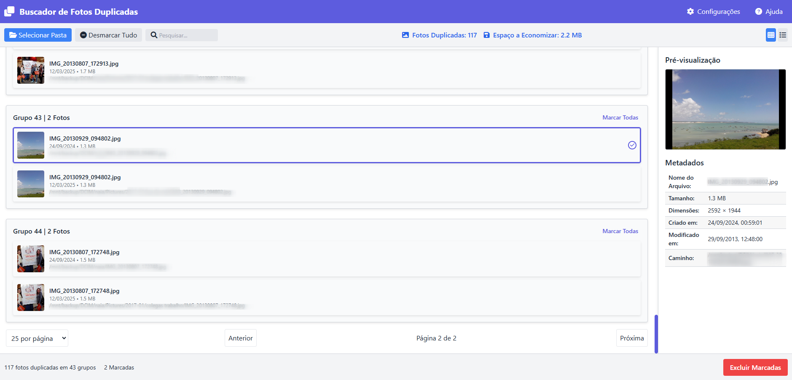

# Buscador de Fotos Duplicadas (Webfdupes)

Este projeto é um aplicativo que permite ao usuário encontrar e gerenciar fotos duplicadas em um diretório especificado.


## Funcionalidades

- **Selecionar Pasta**: Permite ao usuário escolher um diretório para escanear em busca de fotos duplicadas.
- **Visualização de Grupos de Fotos**: Exibe grupos de fotos duplicadas encontradas durante o escaneamento.
- **Modo Escuro**: Alterna entre temas claro e escuro para melhor usabilidade em diferentes condições de iluminação.
- **Paginação**: Permite que o usuário visualize os resultados em páginas, com opções para 25, 50 ou 100 itens por página.
- **Excluir Marcadas**: Move as fotos selecionadas para a lixeira.

## Tecnologias Utilizadas

- **HTML/CSS**: Para a estrutura e estilo da interface do usuário.
- **JavaScript**: Para a lógica do aplicativo e manipulação do DOM.
- **Tailwind CSS**: Para estilização responsiva e moderna.
- **fdupes**: Ferramenta de linha de comando usada para encontrar fotos duplicadas.

## Como Usar

1. Clone o repositório:
   ```bash
   git clone <URL_DO_REPOSITORIO>
   cd <NOME_DA_PASTA>
   ```
2. Abra o arquivo `index.html` em um navegador.
3. Clique em "Selecionar Pasta" para escolher um diretório.
4. O aplicativo escaneará as fotos e exibirá os resultados.
5. Utilize o toggle para alternar entre o modo claro e escuro.
6. Navegue pelos grupos de fotos e exclua as que não deseja manter.

## Contribuições

Contribuições são bem-vindas! Sinta-se à vontade para abrir um pull request ou relatar problemas.

## Licença

Este projeto está licenciado sob a MIT License.

## Arquivos do Projeto

- `index.html` - Interface principal do usuário (frontend)
- `duplicate-finder-backend.php` - Backend para processamento de solicitações
- `image.php` - Gerenciador de imagens para miniaturas e visualizações

## Personalização

### Alterando aparência

Modifique as variáveis CSS no início do arquivo HTML para alterar cores:

```css
:root {
    --primary-color: #3b82f6; /* Cor principal */
    --secondary-color: #1e40af; /* Cor secundária */
    --bg-color: #ffffff; /* Cor de fundo (modo claro) */
    --text-color: #1f2937; /* Cor do texto (modo claro) */
}

.dark {
    --bg-color: #181818; /* Cor de fundo (modo escuro) */
    --text-color: #e5e7eb; /* Cor do texto (modo escuro) */
}
```

## Agradecimentos

- [fdupes](https://github.com/adrianlopezroche/fdupes) - Ferramenta para encontrar arquivos duplicados
- [trash-cli](https://github.com/andreafrancia/trash-cli) - Interface de linha de comando para a lixeira
- [Tailwind CSS](https://tailwindcss.com) - Framework CSS utilizado na interface
- [Font Awesome](https://fontawesome.com) - Ícones utilizados na interface
